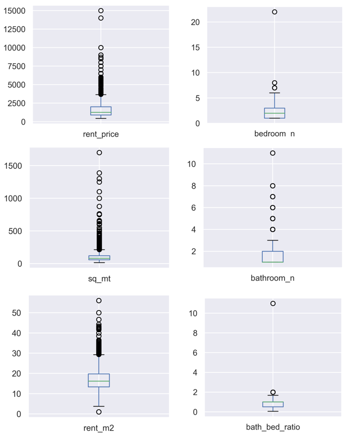
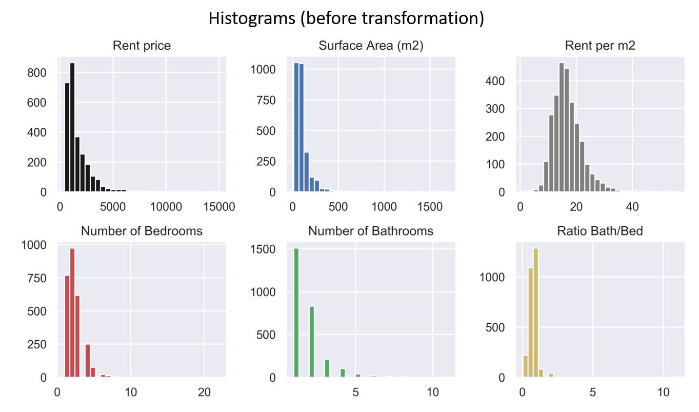

# Data Science Rental Estimator from Houses in Madrid: End to end project

* Created a tool that estimates rental prices from Madrid houses which can aid flat owners as well as people looking for a house to get an idea of the Real State Market in Madrid.

[See full project here.](https://github.com/EnriqueSPR/house_renting_madrid/blob/master/model/Madrid_house_rental.ipynb)

### Summary:

* Scraped over 2000 house rent information from https://www.pisos.com/ using python and the beautifulsoup library.

* Performed data cleaning steps and removed outliers.

* Exploratory Data Analyses shed light into the most important parameters driving house prices in Spain. These parameters were chosen in the model building process.

* Optimized Linear, Lasso, Decission Tree, Random Forest, Support Vector Regressors using GridsearchCV to find the best model.

* Wrote a python flask server that uses the saved model to serve http requests.

* Built a website in html, css and javascript that allows user to predict rental prices in Madrid.

### Code and Resources Used

**Python Version**: 3.7

**Packages**: pandas, numpy, beautifulsoup, sklearn, scipy, matplotlib, seaborn, flask, json, pickle.

# 1. WebScrapping

Used beautifulsoup to retrieve the rent price, location, square meters of the house, number of bedrooms and number of bathrooms.

# 2. Data Cleaning
 
  * Formatted some columns
  
  * Parsed rent price 

  * Handling Nans
  
Created the following variables:

  * Rent price per square meter
  
  * Number of bathrooms/ Number of bedrooms ratio
  

# 3. Exploratory Data Analyses (EDA)

Looked at the distributions of the data, value counts and correlation among the various numeric variables. Below are a few highlight figures.

      

 

 

After the EDA, data was boxcox transformed and some outliers removed

# 4. Model Selection and Tunning

Categorical variables were transformed into dummy variables. Data was splitted into train and tests sets with a test size of 20%.

I tried five different models and evaluated them using Score and Mean Absolute Error. 

**Model Performance**: 

# 5. Productionization

* In this step, I built a flask API endpoint that was hosted on a local webserver. The API endpoint takes in a request with the list of house parameters and returns the estimated price. A website that makes use of the model prediction was also created.

* Secondly, I built locally an app with the [Streamlit](https://streamlit.io/) package and deployed it using the [Heroku](https://dashboard.heroku.com/apps) framework. 
Click **[here](https://house-pred-madrid-st.herokuapp.com/)** to give it a try.

