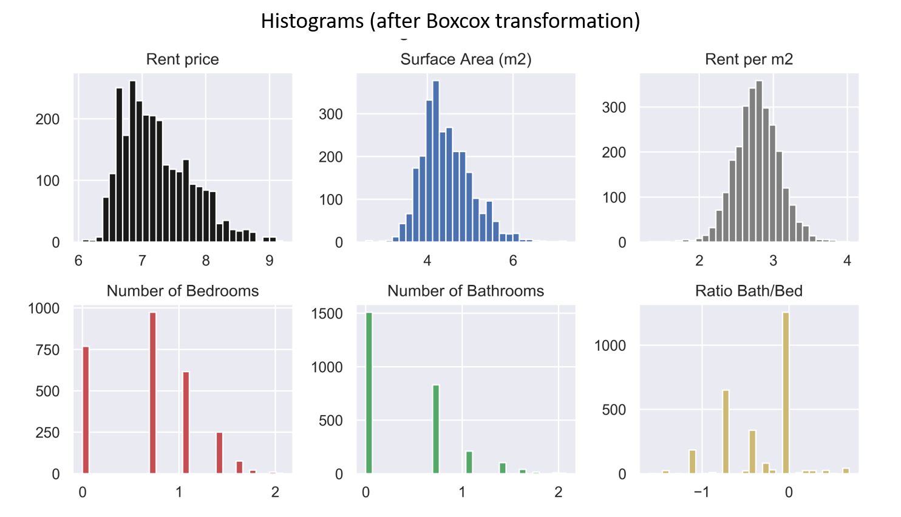

# Data Science Rental Estimator from Houses in Madrid: End to end project

* Created a tool that estimates rental prices from Madrid houses which can aid flat owners as well as people looking for a house to get an idea of the Real State Market in Madrid.

* Scraped over 2000 house rent information from https://www.pisos.com/ using python and beautifulsoup.

* Performed data cleaning steps and removed outliers.

* Exploratory Data Analyses shed light into the most important parameters driving house prices in Spain.These parameters were chosen in the model building process.

* Optimized Linear, Lasso, Decission Tree, Random Forest, Support Vector Regressors using GridsearchCV to find the best model.

* Wrote a python flask server that uses the saved model to serve http requests.

* Built a website in html, css and javascript that allows user to predict rental prices in Madrid.

# Code and Resources Used

**Python Version**: 3.7

**Packages**: pandas, numpy, beautifulsoup, sklearn, scipy, matplotlib, seaborn, flask, json, pickle

# 1. WebScrapping

Used beautifulsoup to retrieve the rent price, location, square meters of the house, number of bedrooms and number of bathrooms.

# 2. Data Cleaning

 I made the following changes:
 
  * Formatted some columns

  * Handling Nans
  
Created the following variables:

  * Rent price per square meter
  
  * Number of bathrooms/ Number of bedrooms ratio
  

# 3. Exploratory Data Analyses (EDA)

Looked at the distributions of the data, value counts and correlation among the various categorical variables. Below are a few highlight figures.

   

     

 

After the EDA, data was boxcox transformed and some outliers removed

# 3. Model Building
Categorical variables  were transformed into dummy variables. Data Wwas splitted into train and tests sets with a test size of 20%.

I tried three different models and evaluated them using Mean Absolute Error. I chose MAE because it is relatively easy to interpret and outliers aren’t particularly bad in for this type of model.

I tried three different models:

Multiple Linear Regression – Baseline for the model
Lasso Regression – Because of the sparse data from the many categorical variables, I thought a normalized regression like lasso would be effective.
Random Forest – Again, with the sparsity associated with the data, I thought that this would be a good fit.

**Model Performance**: 
* Random Forest: Best_Score = 0.89
* Decission Tree Regression: Best_Score = 0.88
* Linear Regression: Best_Score = 0.86

  

# 4. Productionization

In this step, I built a flask API endpoint that was hosted on a local webserver. The API endpoint takes in a request with the list of house parameters and returns the estimated price. A website that makes use of the model prediction was also created.

